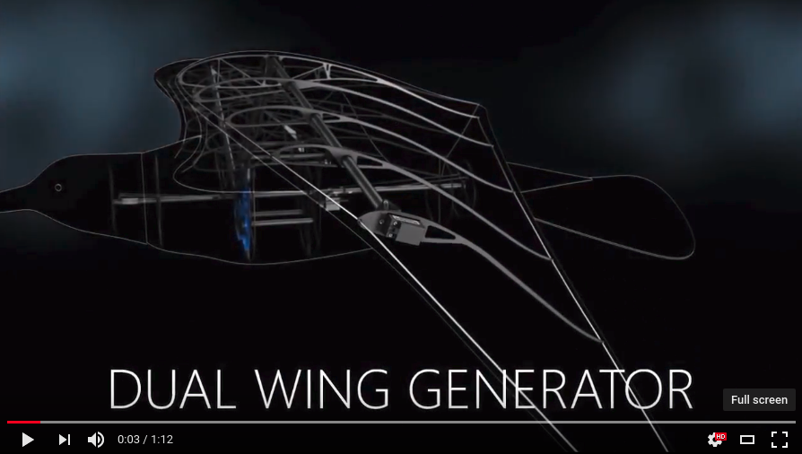
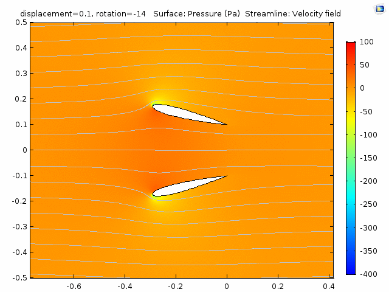
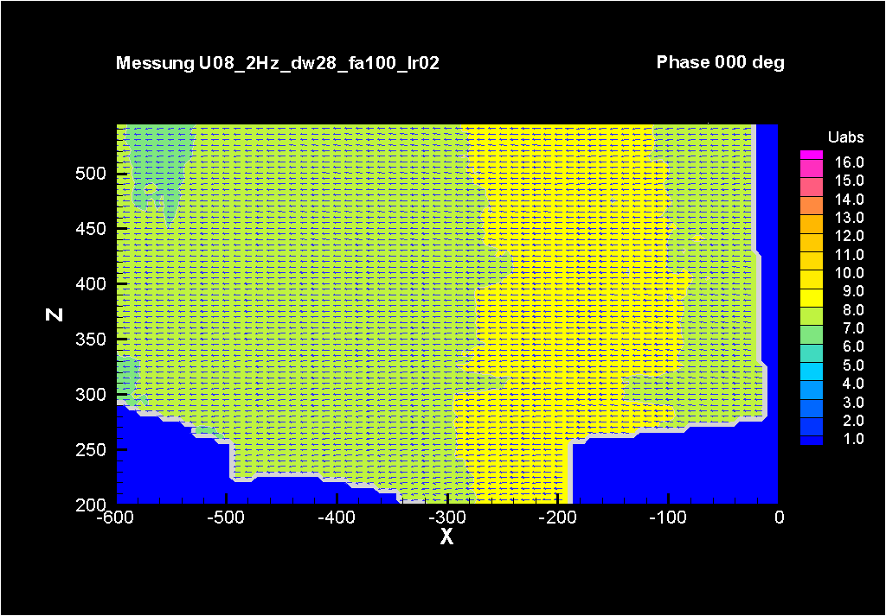
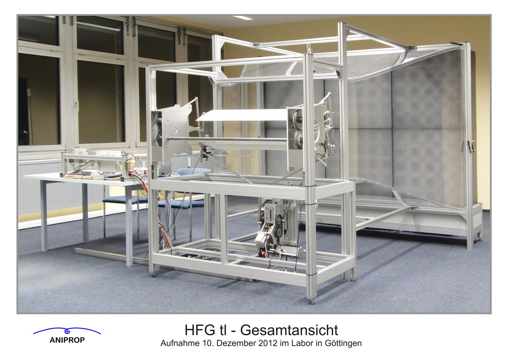

# Dual Wing Generator

For my undergraduate physics thesis at [Middlebury College](www.middlebury.edu), I did a computational fluid dynamics (CFD) simulation of [Festo's Dual-Wing generator](https://www.festo.com/group/en/cms/10222.htm) using COMSOL CFD package. This work is done in 2016, supervised by Prof. Richard Wolfson.

## What is Dual Wing Generator

Birds expend energy to flap their wings and thrust through the wind. Reverse engineering this process, Festo designed a pair of oscillating airfoils, mimicing the flapping wings, to extract wind energy. Instead of having the airfoils beating against the wind, the generator let the wind drive the airfoils to oscillate and thus produce electricity along the way.

### My Project

Festo claims in a low wind environment this wind generator prototype can extract energy more efficiently than its traditional larger counterparts such as wind turbines. My thesis verifies this claim from a quasi-static perspective by modeling the energy output of the system approximated by the kinetic energy involved in the cyclical motion of the airfoils.

CFD simulation plots the pressure distribution around the DWG at wind speed of 8m/s.

<object data="http://www.cs.middlebury.edu/~yanweiw/felix_thesis" type="application/pdf" width="700px" height="700px">
    <embed src="http://www.cs.middlebury.edu/~yanweiw/felix_thesis">
        This browser does not support PDFs. Please download the PDF to view it: <a href="http://www.cs.middlebury.edu/~yanweiw/felix_thesis">Download PDF</a>.

    </embed>
</object>

### Cross Validation of My Results

[Dr. Wolfgang Send](http://www.aniprop.de/dlrhp) is the lead scientist behind Festo's DWG project. After I shared with him my results, he sent me the experimental flow data he acquired using particle image velocimetry (PIV). The similarity between his experimental plots and my simulation plots suggests the validity of my results. Details of his work on this can be found in his [paper](http://link.springer.com/chapter/10.1007/978-3-319-27279-5_77).

PIV flow data at wind speed of 8m/s. Photo courtesy of Dr. Wolfgang Send.

Experimental setup of the DWG for PIV data acquisition. Photo courtesy of Dr. Wolfgang Send.

### Questions

If you have any questions regarding this project, you can find my contact info as well as other projects at my [portfolio page](). 
